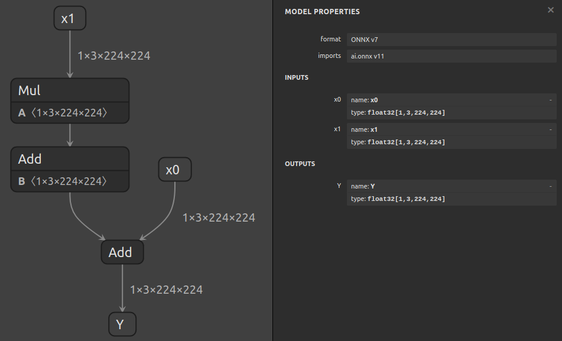
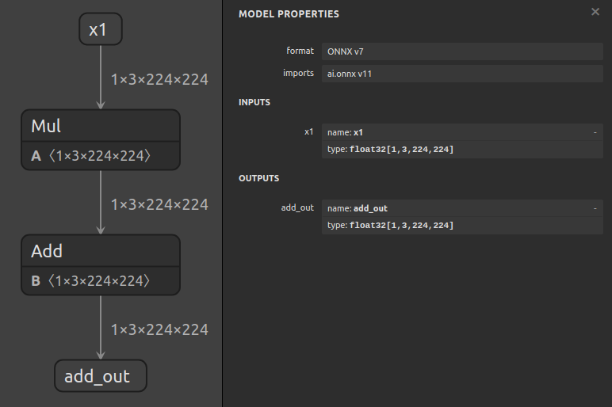

# Using Extract To Isolate A Subgraph


## Introduction

The `surgeon extract` subtool can be used to extract a subgraph from a model with a single command.

In this example, we'll extract a subgraph from a model that computes `Y = x0 + (a * x1 + b)`:



Let's assume that we want to isolate the subgraph that computes `(a * x1 + b)`, and that we've
used `polygraphy inspect model model.onnx --show layers` to determine the names of the input/output tensors
of this subgraph, but that we don't know the shapes or data types of any of the tensors involved.

When shapes and data types are unknown, you can use `auto` to indicate that Polygraphy should
attempt to automatically determine these.
For inputs, we must specify both shape and data type, whereas outputs only require the data
type - hence `--inputs` requires 2 `auto`s and `--outputs` requires only 1.


## Running The Example

1. Extract the subgraph:

    ```bash
    polygraphy surgeon extract model.onnx \
        --inputs x1:auto:auto \
        --outputs add_out:auto \
        -o subgraph.onnx
    ```

    If we knew the shapes and/or data types, we could instead write, for example:

    ```bash
    polygraphy surgeon extract model.onnx \
        --inputs x1:[1,3,224,224]:float32 \
        --outputs add_out:float32 \
        -o subgraph.onnx
    ```

    The resulting subgraph will look like this:

    

2. **[Optional]** At this point, the model is ready for use. You can use `inspect model`
    to confirm whether it looks correct:

    ```bash
    polygraphy inspect model subgraph.onnx --show layers
    ```

## A Note On `auto`

When `auto` is specified as a shape or data type, Polygraphy relies on ONNX shape
inference to determine the shapes and data types of intermediate tensors.

In cases where ONNX shape inference cannot determine shapes, Polygraphy
will run inference on the model using ONNX-Runtime with synthetic input data
You can control the shape of this input data using the `--model-inputs` argument
and the contents using the `Data Loader` options.

This will cause the inputs of the resulting subgraph to have fixed shapes. You can change
these back to dynamic by using the extract command again on the subgraph, and specifying
the same inputs, but using shapes with dynamic dimensions, e.g. `--inputs identity_out_0:[-1,-1]:auto`

=================================================================
这段文档描述了如何使用 Polygraphy 工具中的 surgeon extract 子工具从一个较大的模型中提取子图。下面是对文档内容的详细解析：
简介
功能概述:surgeon extract 子工具可以用来从一个模型中以单一命令的形式提取子图。
示例中，会从计算公式为 Y = x0 + (a * x1 + b) 的模型中提取出计算 (a * x1 + b) 的子图。
图像参考:原始模型结构：model.png;提取出的子图结构：subgraph.png
输入输出张量信息
使用 polygraphy inspect model model.onnx --show layers 来确定想要隔离的子图的输入和输出张量名称。
当形状和数据类型未知时，可以使用 auto 指示 Polygraphy 尝试自动确定这些值。对于输入，必须同时指定形状和数据类型；而对于输出，则只需要指定数据类型。

运行实例
提取子图:当不知道具体的形状和数据类型时：
polygraphy surgeon extract model.onnx \
    --inputs x1:auto:auto \
    --outputs add_out:auto \
    -o subgraph.onnx
如果知道了形状和/或数据类型，则可以这样写：
polygraphy surgeon extract model.onnx \
    --inputs x1:[1,3,224,224]:float32 \
    --outputs add_out:float32 \
    -o subgraph.onnx
可选步骤：验证提取结果;你可以使用 inspect model 命令来确认提取的子图是否正确：
polygraphy inspect model subgraph.onnx --show layers

关于 auto 的说明
当使用 auto 作为形状或数据类型的占位符时，Polygraphy 依赖 ONNX 形状推断来确定中间张量的形状和数据类型。
在 ONNX 形状推断无法确定形状的情况下，Polygraphy 会使用带有合成输入数据的 ONNX-Runtime 对模型进行推理。可以通过 --model-inputs 参数控制输入数据的形状以及通过 Data Loader 选项控制其内容。
这将导致结果子图的输入具有固定的形状。如果需要，可以再次使用 extract 命令对子图进行处理，并指定动态维度的形状（例如 --inputs identity_out_0:[-1,-1]:auto），以此将固定形状改回动态形状。
这个过程非常有用，尤其是在需要对特定部分的模型进行分析、优化或者调试的时候。它允许用户快速地从大型复杂的模型中分离出感兴趣的子图，以便进一步操作。

