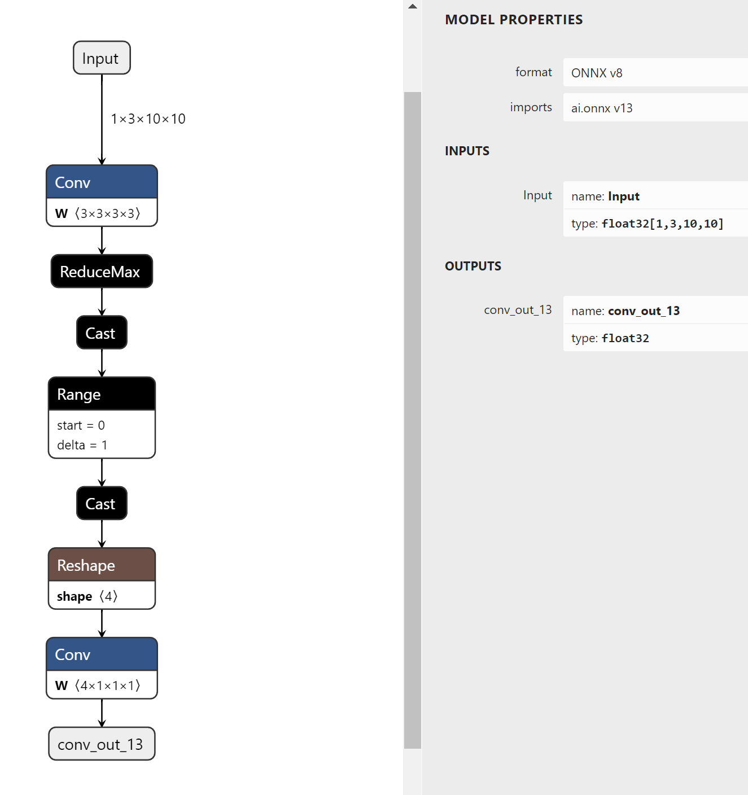
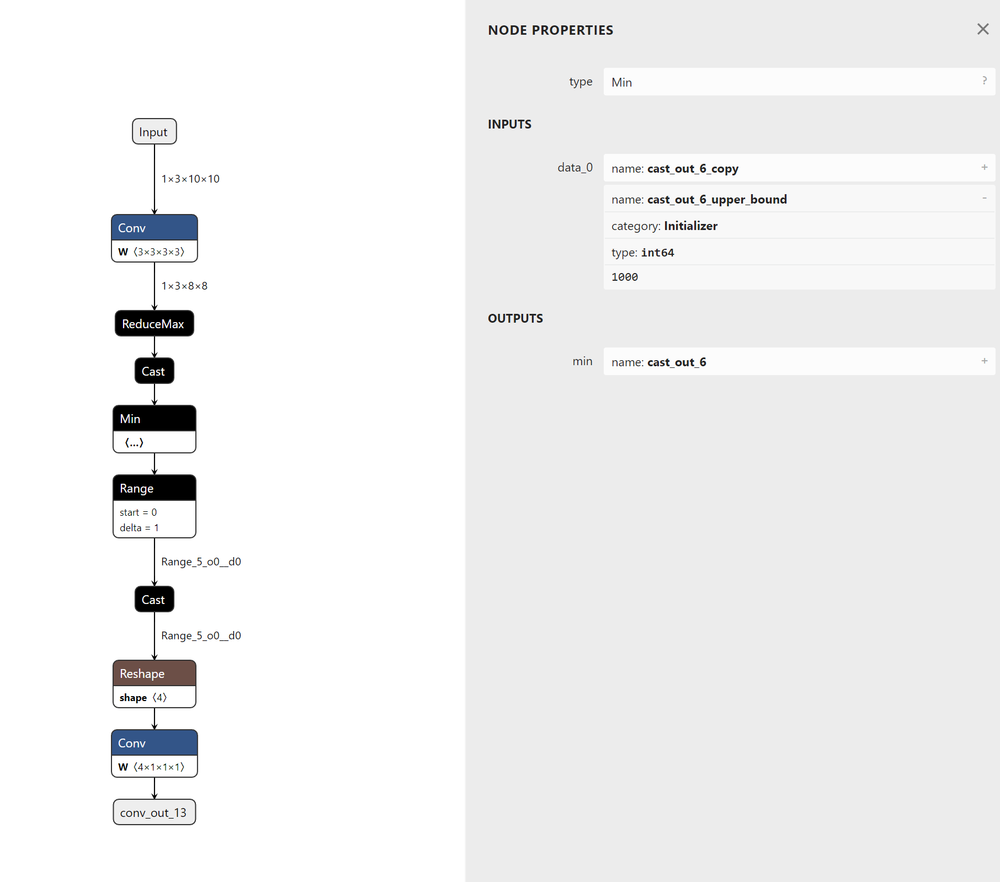

# Using Sanitize To Set Upper Bounds For Unbounded Data-Dependent Shapes (DDS)


## Introduction

The `surgeon sanitize` subtool can be used to set upper bounds for unbounded Data-Dependent Shapes (DDS).
When the shape of a tensor depends on the runtime value of another tensor, such shape is called DDS.
Some DDS has a limited upper bound. For example, the output shape of a `NonZero` operator is a DDS, but its output shape will not exceed the shape of its input.
While, some other DDS has no upper bound. For example, the output of a `Range` operator has an unbounded DDS when the `limit` input is a runtime tensor.
Tensors with unbounded DDS are difficult for TensorRT to optimize inference performance and memory usage at builder stage. 
In the worst case, they can cause TensorRT engine building failures. 

In this example, we'll use polygraphy to set upper bounds for an unbounded DDS in a graph:




## Running The Example

1. Run constant folding for the model first:

    ```bash
    polygraphy surgeon sanitize model.onnx -o folded.onnx --fold-constants
    ```

    Note that const folding and symbolic shape inference are required for listing unbounded DDS and setting upper bounds.

2. Find tensors with unbounded DDS with:

    ```bash
    polygraphy inspect model folded.onnx --list-unbounded-dds
    ```

    Polygraphy will show all tensors with unbounded DDS.

3. Set upper bounds for unbounded DDS with:

    ```bash
    polygraphy surgeon sanitize folded.onnx --set-unbounded-dds-upper-bound 1000 -o modified.onnx 
    ```

    Polygraphy will first search all tensors with unbounded DDS. 
    Then it will insert min operators with the provided upper bound values to limit the DDS tensor size.
    In this example, a min operator is inserted before the `Range` operator.
    With the modified model, TensorRT will know that the output shape of the `Range` operator will not exceed 1000.
    Thus more kernels can be selected for the following layers.

    

4. Check that there is no tensors with unbounded DDS now:

    ```bash
    polygraphy inspect model modified.onnx --list-unbounded-dds
    ```

    The modified.onnx should contain no unbounded DDS now.
===============================================================

这段文档描述了如何使用 Polygraphy 工具的 surgeon sanitize 子工具为具有数据依赖形状（Data-Dependent Shapes, DDS）的张量设置上界，特别是针对那些没有明确上限的数据依赖形状。以下是对此文档的详细解析：
简介：
数据依赖形状（DDS）：当一个张量的形状依赖于另一个张量在运行时的值时，这种形状被称为数据依赖形状（DDS）。有些 DDS 具有明确的上限，例如 NonZero 操作符的输出形状就是一个 DDS，但它的大小不会超过输入张量的形状。另一方面，某些 DDS 并没有明确的上限，比如当 Range 操作符的 limit 输入是一个运行时张量时，其输出的 DDS 是无界的。
对 TensorRT 的影响：张量若具有无界 DDS，则会使得 TensorRT 在构建阶段优化推理性能和内存使用变得困难。在最坏的情况下，这可能导致 TensorRT 引擎构建失败。本示例将展示如何使用 Polygraphy 为模型中的无界 DDS 设置上限。

运行实例：
步骤 1：常量折叠
首先，对模型执行常量折叠（constant folding），这是为了后续步骤中列出无界 DDS 和设置上限所需的过程。
polygraphy surgeon sanitize model.onnx -o folded.onnx --fold-constants
步骤 2：查找具有无界 DDS 的张量
接下来，使用以下命令查找所有具有无界 DDS 的张量。
polygraphy inspect model folded.onnx --list-unbounded-dds
此命令会显示所有具有无界 DDS 的张量信息。

步骤 3：为无界 DDS 设置上限
通过以下命令为无界 DDS 设置上限值（在这个例子中是 1000）。
polygraphy surgeon sanitize folded.onnx --set-unbounded-dds-upper-bound 1000 -o modified.onnx 
Polygraphy 首先会搜索所有具有无界 DDS 的张量，然后插入最小操作符（min operators）以限制这些 DDS 张量的大小不超过指定的上限值。例如，在这个例子中，会在 Range 操作符前插入一个最小操作符，这样 TensorRT 就知道 Range 操作符的输出形状不会超过 1000，从而可以为后续层选择更多的内核。

步骤 4：确认无界 DDS 已被处理
最后，再次检查修改后的模型，确保现在没有无界 DDS。
polygraphy inspect model modified.onnx --list-unbounded-dds
如果一切顺利，modified.onnx 应该不再包含任何无界 DDS。

总结来说，这份文档展示了如何利用 Polygraphy 工具解决 ONNX 模型中由于存在无界数据依赖形状而导致的潜在问题，通过为这些无界 DDS 设置合理的上限来提高 TensorRT 在优化阶段的表现。